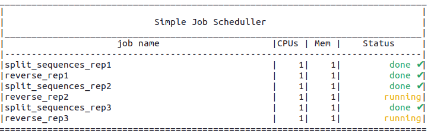

# SnapFlow
Simple workflow manager in python.


### Advantages
- no metalanguage involved. This is pure Python.
- minimum complexity, with no restrictions on objects types or I/O for process functions. There are no channels to store files, no piping between processes...
- no hashes in output paths. Only human-readable path. Outputs are organized mirroring function and modules hierarchies.
- not interactive. The software generates:
  - a list of commands and their corresponding execution constraints (dependencies, time, number of CPUs, memory...)
  - the output folder hierarchy and required binaries

### Disadvantages
- not interactive: Although we provide a very simple local job scheduler (check the `snap_scheduler` command) for testing purposes, SnapFlow is completely independent from the batch queuing systems (i.e. Slurm, LSF, OGE, etc...). You should write a script to pass the list of commands and the execution constraints to the queuing system.

*An example of such parser, compatible with Slurm, can be found [here](https://github.com/fransua/slurm_utils/blob/master/scripts/submitting/slurm_do.py).*


## Basic example

Can be found in in `examples/basic_pipeline`.

The idea of the pipeline os to process 3 FASTA files in the following manner:
  - split the file by sequence
  - reverse the sequences
  - compute some stats about the original sequences.

### Configuration file

We first create a yaml file that contain the path to the input files `params.yaml`:

```yaml
test:
  input: 
    - Data/sample_1.fa
    - Data/sample_2.fa
    - Data/sample_3.fa
```

### Main workflow

then, using the template of the generate_workflow we add this lines:

```python
    ###########################################################################
    # START WORKFLOW

    # place to store workflow jobs/task:
    processes = Process_dict(params, name='Basic pipeline')

    ## Split sequences in the fasta into different files
    for rep, replicate in enumerate(params['input'], 1):
        splitted = split_sequences(replicate, replicate_name=f"rep{rep}", time="5:00")

        ## Reverse each sequence
        reverse(splitted, replicate_name=f"rep{rep}", time="1:00")
        
        count_bases(splitted, replicate_name=f"rep{rep}", time="2:00")

    ####
    # END WORKFLOW
    processes.write_commands(opts.sequential)
    processes.do_mermaid(result_dir)
```

### Modules - secondary workflows

Inside the modules folder we can create the `rule` functions to process the input as wanted.

first the splitting and reversing:
```python
from sf import IO_type, rule


@rule
def split_sequences(replicate, **kwargs):
    input_  = {
        'seq_path' : IO_type('path', replicate),
        }

    output = {
        'splitted_files': f"seq_*",
        }

    cmd = f"""awk '/^>/{{f="seq_"++d}} {{print > f}}' < {input_['seq_path']}"""


@rule
def reverse(splitted, **kwargs):
    input_  = {
        'sequences': IO_type('path' , 'splitted_files', splitted),
        }

    output = {
        'reversed': "reversed.fa",
        }

    cmd = f"""
    python bin/reverse_sequences.py {input_['sequences']} {output['reversed']}
"""
```

`rule` functions should have the `@rule` decorator, accept a `**kwargs` parameter and contain at least this 3 variables:
  - `input_` : to hold a dictionary of the input data
  - `output` : to hold a dictionary of the output data
  - `cmd`: to store the command to be run

  *Note: `input_` and `output` variables defined here are used to define the job dependency graph.*

in parallel we can also create a rule to get some stats about sequences:

```python
import os
from sf import IO_type, rule


@rule
def count_bases(splitted, **kwargs):

    input_  = {
        'sequences': IO_type('path' , 'splitted_files', splitted),
        }

    output = {
        'stats': "stats.txt",
        }

    cmd = f"""
for f in `ls {input_['sequences']}`;
  do 
    echo `head -n 1 $f`: `grep -v '>' $f | awk '{{print}}' ORS='' | wc -c` >> {output['stats']};
  done
echo Total sequences: `cat {input_['sequences']} | grep -v '>'| wc -l` >> {output['stats']}
echo Total bases: `cat {input_['sequences']} | grep -v '>'| wc -l` >> {output['stats']}
"""

    publish = [
        (output['stats'] , os.path.join('results', 'log')),
    ]

```
*Note: the publish variable created here that will be used to copy the wanted output files into the results folder.*

To create a rule we just use the `rule` decorator on a function that contains 3 variables: `input_`, `output` and `cmd`.
The decorator will take care of creating the graph of processes using the input and output defined here.

### Workflow structure

At the end our project could look like this:
```text
.
├── basic_workflow.py
├── bin
│   └── reverse_sequences.py
├── Data
│   ├── sample_1.fa
│   ├── sample_2.fa
│   └── sample_3.fa
├── modules
│   ├── Sequence_stats.py
│   └── sequence_transformation.py
└── params.yaml
```

### Generation of the tasks

This script can be run as such:

```bash
python basic_workflow.py --sample test -o basic_run -p params.yaml
```

The output would be:

```text
[name scHiC-split_sequences_rep1;cpus-per-task 1;time 5:00]  /bin/bash /home/fransua/Box/SnapFlow/examples/basic_pipeline/basic_run/tmp/sequence_transformation/split_sequences/rep1/.command.sh
[name scHiC-reverse_rep1;cpus-per-task 1;time 1:00;depe 1]  /bin/bash /home/fransua/Box/SnapFlow/examples/basic_pipeline/basic_run/tmp/sequence_transformation/reverse/rep1/.command.sh
[name scHiC-count_bases_rep1;cpus-per-task 1;time 2:00;depe 1]  /bin/bash /home/fransua/Box/SnapFlow/examples/basic_pipeline/basic_run/tmp/Sequence_stats/count_bases/rep1/.command.sh
[name scHiC-split_sequences_rep2;cpus-per-task 1;time 5:00]  /bin/bash /home/fransua/Box/SnapFlow/examples/basic_pipeline/basic_run/tmp/sequence_transformation/split_sequences/rep2/.command.sh
[name scHiC-reverse_rep2;cpus-per-task 1;time 1:00;depe 4]  /bin/bash /home/fransua/Box/SnapFlow/examples/basic_pipeline/basic_run/tmp/sequence_transformation/reverse/rep2/.command.sh
[name scHiC-count_bases_rep2;cpus-per-task 1;time 2:00;depe 4]  /bin/bash /home/fransua/Box/SnapFlow/examples/basic_pipeline/basic_run/tmp/Sequence_stats/count_bases/rep2/.command.sh
[name scHiC-split_sequences_rep3;cpus-per-task 1;time 5:00]  /bin/bash /home/fransua/Box/SnapFlow/examples/basic_pipeline/basic_run/tmp/sequence_transformation/split_sequences/rep3/.command.sh
[name scHiC-reverse_rep3;cpus-per-task 1;time 1:00;depe 7]  /bin/bash /home/fransua/Box/SnapFlow/examples/basic_pipeline/basic_run/tmp/sequence_transformation/reverse/rep3/.command.sh
[name scHiC-count_bases_rep3;cpus-per-task 1;time 2:00;depe 7]  /bin/bash /home/fransua/Box/SnapFlow/examples/basic_pipeline/basic_run/tmp/Sequence_stats/count_bases/rep3/.command.sh


```
This output can be parsed to generate commands with dependency rules.

The script also generates a DAG representing the job dependency graph that looks like:


After execution of the commands in the computing cluster, the output is organized as such:

```text
basic_run
├── bin
│   └── reverse_sequences.py
├── DAG.mmd
├── results
│   └── log
│       └── stats.txt
├── test_params.yaml
└── tmp
    ├── Sequence_stats
    │   └── count_bases
    │       ├── rep1
    │       │   └── stats.txt
    │       ├── rep2
    │       │   └── stats.txt
    │       └── rep3
    │           └── stats.txt
    └── sequence_transformation
        ├── reverse
        │   ├── rep1
        │   ├── rep2
        │   └── rep3
        └── split_sequences
            ├── rep1
            │   ├── seq_1
            │   ├── seq_2
            │   └── seq_3
            ├── rep2
            │   ├── seq_1
            │   ├── seq_2
            │   └── seq_3
            └── rep3
                ├── seq_1
                ├── seq_2
                └── seq_3

```

The structure of the output respects the module structure defined.

### Testing locally

For testing purposes we developped a simple job scheduler that takes as input the list of jobs/tasks generated above. It can be called as such:

```bash
python basic_workflow.py --sample test -o basic_run -p params.yaml | snap_scheduler
```

This command will activate a console to monitor the distribution and processing of the tasks:




## Advanced options

### The rule function

The rule decorator to put before a process function reads the kwargs parameter
 searching for specific keywords as `time` or `cpus`. 
 
 The complete list is:
 - `time`: a string with the maximum time estimated for the process
 - `cpus`: number of CPUs needed in the assigned computational node.
 - `memory`: maximum memory allowed to be used by the process
 - `singularity`: path to a singularity image (use a blank space `singularity=" "` to override the global singularity definition.)
 - `env`: a string with some environments setup (i.e.: `module load samtools`)
 - `replicate_name`: name extension for the process. It is compulsory when a process is called more than once.
